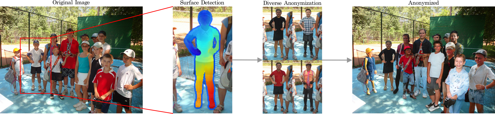
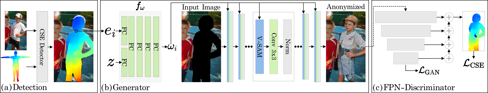

# Realistic Full-Body Anonymization with Surface-Guided GANs

**Source code will be available shortly (by the latest Friday the 14th of January)**

This is the official source code for the paper "Realistic Full-Body Anonymization with Surface-Guided GANs".

[[Arixv Paper]]()
[[Appendix]](https://folk.ntnu.no/haakohu/fba_appendix.pdf)

Surface-guided GANs is an automatic full-body anonymization technique based on Generative Adversarial Networks.

The key idea of surface-guided GANs is to guide the generative model with dense pixel-to-surface information (based on [continuous surface embeddings](https://arxiv.org/abs/2011.12438)). This yields highly realistic anonymization result and allows for diverse anonymization.

